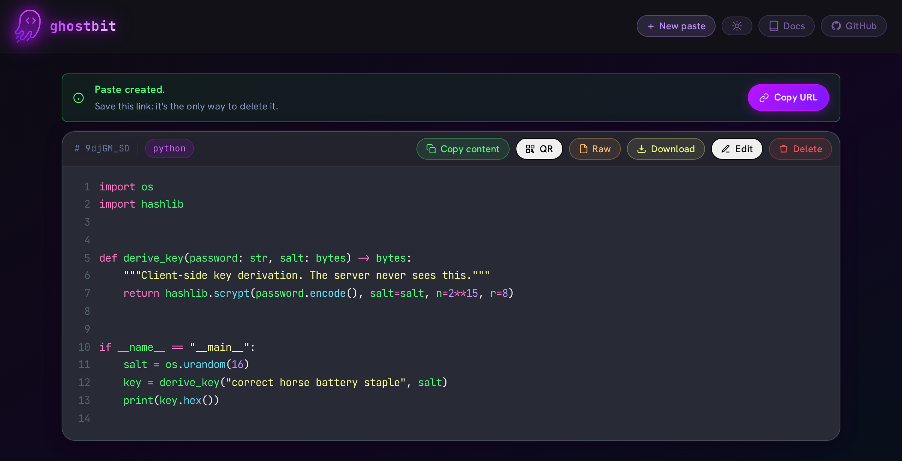
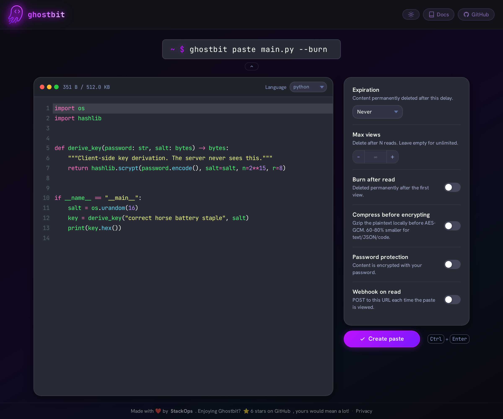
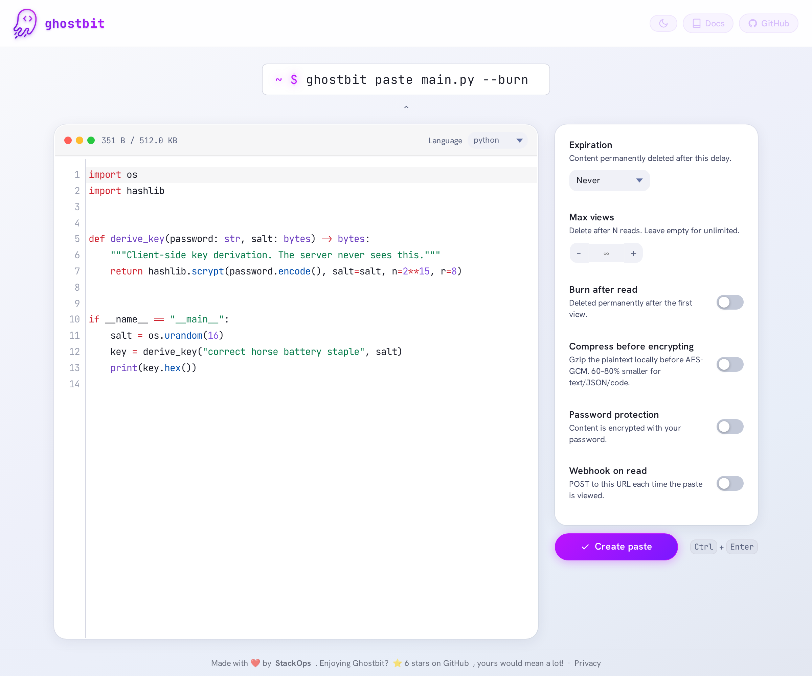

<p align="center">
  
</p>

<h1 align="center">Ghostbit</h1>

<p align="center">
  <strong>Share a secret, not your data.</strong><br>
  Self-hosted, end-to-end encrypted pastes. The server stores ciphertext and nothing else.
</p>

<p align="center">
  <a href="https://ghostbit.dev">Try it</a>
  &nbsp;·&nbsp;
  <a href="https://docs.ghostbit.dev">Documentation</a>
  &nbsp;·&nbsp;
  <a href="#self-hosting">Self-host it</a>
  &nbsp;·&nbsp;
  <a href="https://pypi.org/project/ghostbit-cli">CLI</a>
  &nbsp;·&nbsp;
  <a href="#contributing">Contribute</a>
</p>

<p align="center">
  
  
  
  
  <br>
  <a href="https://docs.ghostbit.dev/compliance/"></a>
  <a href="https://docs.ghostbit.dev/compliance/"></a>
  <a href="https://docs.ghostbit.dev/compliance/"></a>
  <a href="https://docs.ghostbit.dev/compliance/"></a>
</p>

---

You paste a config file with a token in it. On a normal pastebin, that token is
now on someone else's disk, in plaintext, forever. Ghostbit encrypts it in your
browser first, and the key never leaves the URL fragment: not in a request, not
in a log, not in a backup. The operator, the host, and anyone who later steals
the database all get the same thing, which is ciphertext.

That is the whole product. Everything below is what it takes to keep that
promise honest.

<p align="center">
  
</p>

<p align="center">
  <em>A paste after client-side decryption. The server only ever stored ciphertext.</em>
</p>

<table>
  <tr>
    <td width="50%"></td>
    <td width="50%"></td>
  </tr>
  <tr>
    <td align="center"><em>Create a paste (dark)</em></td>
    <td align="center"><em>Create a paste (light)</em></td>
  </tr>
</table>

---

## Try it in 60 seconds

```bash
podman run --rm -p 8000:8000 ghcr.io/stackopshq/ghostbit:latest   # or docker run
```

Open <http://localhost:8000> and paste something. SQLite is the default backend,
so there is nothing else to install. When you like it, read
[Self-hosting](#self-hosting) for the version you would actually run in front of
other people, starting with [which tag to pull](#image-tags).

Prefer your terminal?

```bash
pip install ghostbit-cli
cat deploy.sh | gbit --burn          # prints one URL, readable exactly once
```

---

## Why Ghostbit

|  | Pastebin-style services | PrivateBin | **Ghostbit** |
|---|---|---|---|
| Server can read your paste | Yes | No | **No** |
| Key location | n/a | URL fragment | **URL fragment** |
| Password KDF | n/a | PBKDF2 | **PBKDF2 or Argon2id** |
| Third-party requests from the page | Analytics, ads, fonts | Few | **None, verified by a test** |
| Access logs by default | Yes | Operator's choice | **Off** |
| Privacy notice built in | Varies | No | **Yes, `/privacy`, names your instance** |
| Official CLI | Rarely | Community | **Yes, `gbit`** |
| Storage | Their disk | SQLite / files | **SQLite or Redis** |

Comparisons are about defaults, not ceilings: a careful PrivateBin operator
lands in a similar place. The difference is how much of it you have to
remember to do yourself.

---

## How it works

Your content is encrypted in the browser with the Web Crypto API before
anything is sent. The key lives in the URL fragment, which browsers never
transmit:

```
https://paste.example.com/aB3kZx9m#KEY~DELETE_TOKEN
                                    ↑
                          never sent to the server
```

| Paste type | Key source | Where the key lives |
|---|---|---|
| No password | `crypto.subtle.generateKey()` | URL `#fragment` |
| With password | PBKDF2-SHA256 (600k iterations) or Argon2id | The reader's memory |

Lose the fragment and the paste is gone for everyone, including us. That is the
point, and it is the one thing to explain to your users before they rely on it.

**Features:** burn after read · view caps · expiry up to a year · password
protection · read webhooks · language auto-detection · in-browser Markdown
preview · QR codes · owner edit and delete · light and dark themes · SQLite or
Redis · a REST API and a CLI for both.

---

## CLI

```bash
pip install ghostbit-cli
```

```bash
cat main.py | gbit                        # paste from stdin
gbit secrets.env --burn --expires 3600    # burn after read, one hour TTL
echo "db_pass=s3cr3t" | gbit -p           # password prompt, never echoed
URL=$(cat deploy.sh | gbit --quiet)       # scripting
gbit config set server https://paste.example.com
gbit list                                 # local history (never synced)
eval "$(gbit completion bash)"            # bash, zsh and fish
```

Full reference: [docs.ghostbit.dev/cli](https://docs.ghostbit.dev/cli/).
There is a [PowerShell module](cli/powershell) too.

---

## Self-hosting

### Image tags

`latest`, `edge` and the semver tags are currently **frozen** at the last
multi-architecture build: the build machine lost its arm64 emulation, and
moving those tags onto an amd64-only image would silently break every arm64
install that follows them. They will move again once arm64 is back.

Until then, every commit on `main` publishes an amd64 `sha-<short-commit>` tag.
For anything you actually run, pull one of those and **pin it by digest**:

```bash
podman pull ghcr.io/stackopshq/ghostbit:sha-3325bcb
podman image inspect --format '{{index .RepoDigests 0}}' ghcr.io/stackopshq/ghostbit:sha-3325bcb
```

`latest` is fine for a local try: it is a real release, just an older one.

### Docker Compose

```bash
git clone https://github.com/stackopshq/ghostbit
cd ghostbit
cp .env.example .env
docker compose up -d
```

The sample publishes on `127.0.0.1` and expects a TLS-terminating reverse proxy
in front. With Redis instead of SQLite:

```bash
STORAGE_BACKEND=redis docker compose --profile redis up -d
```

### Podman Quadlet

Create `/etc/containers/systemd/ghostbit.container` (system-wide) or
`~/.config/containers/systemd/ghostbit.container` (rootless):

```ini
[Unit]
Description=Ghostbit paste service
After=network-online.target

[Container]
Image=ghcr.io/stackopshq/ghostbit:sha-3325bcb
PublishPort=127.0.0.1:8000:8000
Volume=ghostbit_data:/data

Environment=STORAGE_BACKEND=sqlite
Environment=SQLITE_PATH=/data/ghostbit.db
Environment=MAX_PASTE_SIZE=524288
Environment=PORT=8000

HealthCmd=wget -qO- http://127.0.0.1:8000/healthz || exit 1
HealthInterval=30s
HealthTimeout=5s
HealthStartPeriod=15s
HealthRetries=3

[Service]
Restart=always

[Install]
WantedBy=default.target
```

```bash
systemctl --user daemon-reload
systemctl --user enable --now ghostbit
```

For Redis, add a `ghostbit-redis.container` alongside and use
`After=ghostbit-redis.service` plus `Environment=STORAGE_BACKEND=redis` and
`Environment=REDIS_URL=redis://ghostbit-redis:6379`. Quadlet handles the pod
networking.

### Encrypted backups

[`scripts/backup.sh`](scripts/backup.sh) streams `python -m app.admin export`
through [age](https://age-encryption.org) into one timestamped `.jsonl.age` file
per run. The plaintext export never touches disk, so a stolen backup is useless
without the private key.

```bash
BACKUP_DIR=/var/backups/ghostbit \
AGE_RECIPIENT="age1xxxxxxxxxxxxxxxxxxxxxxxxxxxxxxxxxxxxxx" \
  scripts/backup.sh
```

Recurring, via the shipped units:

```bash
sudo cp scripts/ghostbit-backup.{service,timer} /etc/systemd/system/
sudo systemctl daemon-reload
sudo systemctl enable --now ghostbit-backup.timer
```

Restore:

```bash
age --decrypt -i ~/.config/age/keys.txt ghostbit-2026-05-24T03-17-00Z.jsonl.age \
  | python -m app.admin import
```

Old backups are pruned after `BACKUP_RETENTION_DAYS` (30 by default).

### Environment variables

| Variable | Default | Description |
|----------|---------|-------------|
| `STORAGE_BACKEND` | `sqlite` | `sqlite` or `redis` |
| `SQLITE_PATH` | `./ghostbit.db` | SQLite file path (Docker overrides to `/data/ghostbit.db`) |
| `SQLITE_POOL_SIZE` | `5` | Pooled SQLite connections (WAL enables parallel readers) |
| `REDIS_URL` | `redis://localhost:6379` | Redis connection URL |
| `REDIS_PASSWORD` | _none_ | Redis password (injected into `REDIS_URL` automatically) |
| `MAX_PASTE_SIZE` | `524288` | Max paste size in bytes (512 KB) |
| `PORT` | `8000` | Server port |
| `RATE_LIMIT_CREATE` | `30/minute` | Limit for creating and mutating pastes |
| `RATE_LIMIT_VIEW` | `120/minute` | Limit for reading pastes |
| `TRUST_PROXY_HEADERS` | `false` | Use rightmost `X-Forwarded-For` for rate limiting (only behind a trusted proxy) |
| `BASE_URL` | _none_ | Public base URL for absolute links in social-preview meta tags |
| `WEBHOOK_SECRET` | _none_ | HMAC-SHA256 secret for signing webhook payloads |
| `GITHUB_REPO` | `stackopshq/ghostbit` | Repo for the footer star count; empty disables the outbound call |
| `ACCESS_LOG` | `false` | Re-enable uvicorn access logs, which pair client IPs with paste IDs |
| `METRICS_TOKEN` | _none_ | Bearer token gating `GET /metrics`; empty leaves it open |
| `PRIVACY_OPERATOR` | _none_ | Name and country of this instance's operator, shown as controller on `/privacy` |
| `PRIVACY_CONTACT_URL` | _none_ | Where `/privacy` sends privacy inquiries |
| `PRIVACY_AUTHORITY` | _none_ | Supervisory authority named on `/privacy` (e.g. `the CNIL (France)`) |

### Compliant deployments (GDPR / nLPD)

<!-- ghost-conformite:debut. The six bolded lead-ins below are the suite's
     rules, canonical in ghostsuite/assets/ghost-readme/GABARIT.md. That repo
     is private, so this page carries a copy rather than a link; the markers
     let a drift check compare the rules. The prose between them is meant to
     be ours: it names our CDN, our retention variable, our outbound call. -->

Ghostbit ships privacy by default: no accounts, no cookies, no third-party
requests from any page, no access logs, encryption in the client. What the
software cannot do for you is the part that depends on **your** deployment.
This checklist is the rest:

1. **Name yourself.** Set `PRIVACY_OPERATOR`, `PRIVACY_CONTACT_URL` and
   `PRIVACY_AUTHORITY` so the built-in `/privacy` page names *you* as the
   controller, which GDPR art. 13 and nLPD art. 19 require. Left unset, the
   page falls back to neutral wording: honest, but not enough for a public
   service.
2. **Leave `ACCESS_LOG` off.** Turning it on records client IP, paste ID and
   timestamp together. You become a processor of personal data, you owe those
   logs a retention, and your `/privacy` page stops being true.
3. **Mind the proxy in front.** Your reverse proxy or CDN logs IPs even when
   Ghostbit does not. Bound their retention, and name the CDN in your notice
   (ghostbit.dev names Cloudflare).
4. **Bound your backups.** Keep the age private key offline and leave
   `BACKUP_RETENTION_DAYS` set. An unbounded archive outlives every retention
   promise you make.
5. **Close the side doors.** Set `METRICS_TOKEN` or firewall `/metrics`, and
   set `GITHUB_REPO=""` if the hourly server-side star-count call has no
   business leaving your network.
6. **Terminate TLS properly.** HTTPS at the proxy, `TRUST_PROXY_HEADERS=true`
   so rate limits key on real clients, and HSTS stays on.

<!-- ghost-conformite:fin -->

The reasoning behind each item, and the audit that produced them, is at
[docs.ghostbit.dev/compliance](https://docs.ghostbit.dev/compliance/).

---

## API

Everything is encrypted client-side, so the API only ever handles ciphertext.
Reference: [docs.ghostbit.dev/api](https://docs.ghostbit.dev/api/); the OpenAPI
schema is served at `/openapi.json`.

```bash
# Create (content must be pre-encrypted; use the CLI or static/e2e.js)
curl -X POST https://paste.example.com/api/v1/pastes \
  -H "Content-Type: application/json" \
  -d '{"content":"<base64 ciphertext>","nonce":"<base64 nonce>","language":"python"}'

# Retrieve (returns ciphertext, the client decrypts)
curl https://paste.example.com/api/v1/pastes/{id}

# Delete
curl -X DELETE https://paste.example.com/api/v1/pastes/{id} \
  -H "X-Delete-Token: <token>"

# Detect language (plaintext, never stored)
curl -X POST https://paste.example.com/api/v1/detect \
  -H "Content-Type: application/json" \
  -d '{"content":"def hello():\n    print(42)"}'
```

Operators also get `/healthz` (liveness, 200 while the process lives),
`/readyz` (readiness, 503 when storage does not answer) and `/metrics`
(Prometheus). Swagger UI and ReDoc are deliberately not served: their default
pages load scripts and fonts from third-party CDNs, which is exactly what the
rest of this app refuses to do.

---

## Security and privacy

Ghostbit is zero-knowledge by construction:

| | The server sees | The server **cannot** see |
|---|---|---|
| Paste content | AES-256-GCM ciphertext | Plaintext |
| Encryption key | Never, it stays in the URL `#fragment` | n/a |
| Password | Never, the KDF runs in the browser or CLI | n/a |
| Delete token | SHA-256 hash only | The token itself |
| Metadata | Language, timestamps, view count | Who created or read anything |

- A compromised server cannot decrypt any paste, past or future.
- No cookies, no analytics, and no third-party request from any page the app
  serves. A test enforces it, so a regression fails CI rather than shipping.
- No access logs by default: the server does not record who read which paste.
- SSRF protection pins webhook deliveries to a validated public IP, which
  defeats DNS rebinding.
- Rate limiting covers every endpoint that creates, reads or mutates a paste.
- Every dependency is pinned, and CI runs a secret scan on each pull request
  plus a vulnerability, secret and misconfiguration scan on `main`.

Found a vulnerability? Please do not open a public issue. Use
[GitHub Security Advisories](https://github.com/stackopshq/ghostbit/security/advisories/new);
[SECURITY.md](SECURITY.md) has the policy, and `/.well-known/security.txt` is
served by every instance.

---

## Contributing

Contributions are genuinely welcome, and small ones are the most welcome of
all: a typo in the docs, a language pattern the detector misses, a rough edge
on mobile. [CONTRIBUTING.md](CONTRIBUTING.md) has the details; the short
version is:

```bash
git clone git@github.com:stackopshq/ghostbit.git
cd ghostbit
python3 -m venv .venv && source .venv/bin/activate
pip install -e '.[dev]' && pip install -e cli/
cp .env.example .env
uvicorn app.main:app --reload --port 8000

pytest tests/ -v      # 126 tests, both storage backends in CI
pre-commit install    # ruff and gitleaks before every commit
```

**One rule above all others:** the server must never see plaintext. A change
that risks leaking the key or the content to the server (a redirect that
re-emits the fragment, analytics on a paste page, logging request bodies,
accepting plaintext on `POST /api/v1/pastes`) is a protocol break, and will be
turned down however good the rest of the patch is. The reasoning lives in
[ADR 0001](docs/adr/0001-zero-knowledge-crypto.md).

Beyond that: keep pull requests small and single-purpose, use
[Conventional Commits](https://www.conventionalcommits.org), add a test when
you change behaviour, and open an issue first if you are unsure whether an idea
fits. Questions and half-formed ideas are welcome as
[issues](https://github.com/stackopshq/ghostbit/issues) too: better asked than
left in a drawer.

Where things live:

| Path | What it is |
|---|---|
| `app/` | FastAPI server: routes, storage backends, webhooks, metrics |
| `static/e2e.js` | Browser crypto, the reference implementation |
| `cli/` | The `gbit` CLI, plus a PowerShell module |
| `templates/` | Jinja2 pages, including `/privacy` |
| `docs/` | The documentation site, with ADRs in `docs/adr/` |
| `tests/` | Pytest suite, run against SQLite and Redis |

---

## License

[Elastic License 2.0](LICENSE). Read it, audit it, self-host it, modify it, run it for your own
organisation. What it reserves is resale: you may not provide Ghostbit to third parties as a hosted
or managed service. That is *source available*, not open source in the OSI sense.

Ghostbit was MIT-licensed until 2026-08-31, and the change is not retroactive: see [NOTICE](NOTICE)
and [ADR-0003](docs/adr/0003-elastic-license-v2.md).

Third-party code and fonts served from `/static/` keep their own licences, and
their attributions are in [THIRD-PARTY-NOTICES.md](THIRD-PARTY-NOTICES.md).

If you run a public instance, please read the
[compliant-deployment checklist](#compliant-deployments-gdpr--nlpd) first.

<p align="center">
  Built by <a href="https://stackops.ch">StackOps</a>, part of the Ghost suite.<br>
  <sub>If Ghostbit is useful to you, a star helps other people find it.</sub>
</p>
